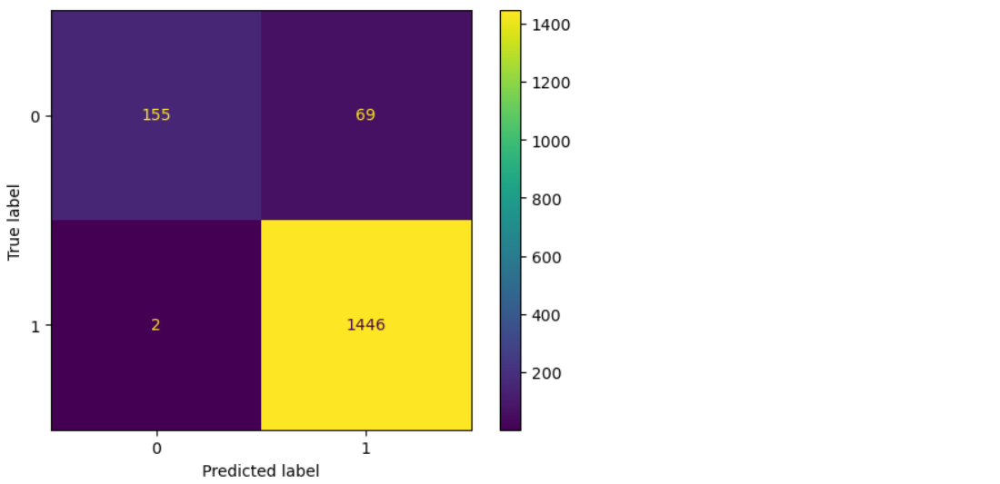
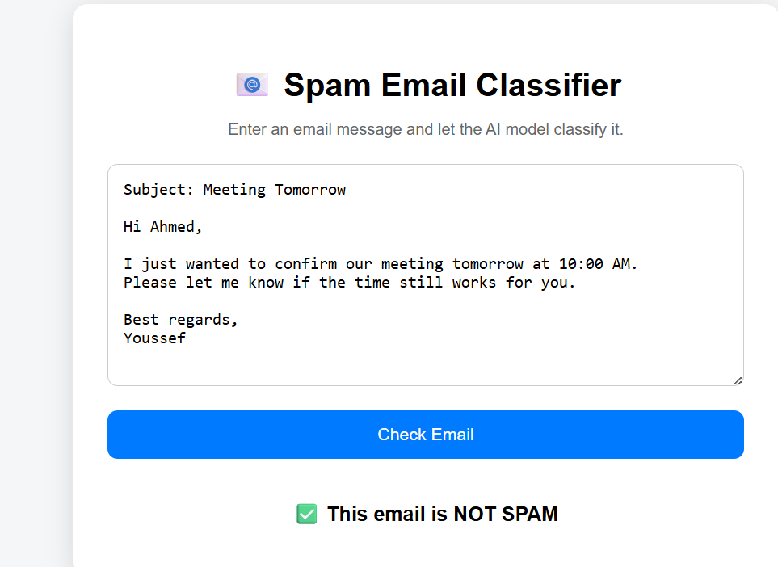
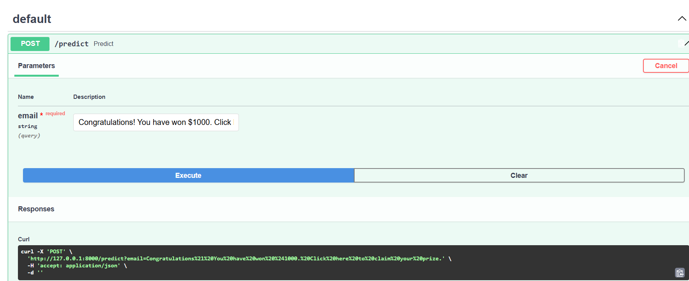

# Spam Email Classifier

## Description
Machine Learning project to classify emails as Spam or Ham using TF-IDF and Logistic Regression.

## Technologies
- Python
- Pandas
- NumPy
- Scikit-learn
- Matplotlib

## Steps
- Data preprocessing
- Feature extraction using TF-IDF
- Model training using Logistic Regression
- Model evaluation

## Evaluation
- Accuracy
- Classification Report
- Confusion Matrix

## 📊 Confusion Matrix

## 🌐 Web Interface

The project includes a simple web interface that allows users to enter an email and check whether it is Spam or Ham.

## 🚀 API

The trained model is deployed using FastAPI and can be accessed through an API endpoint.

